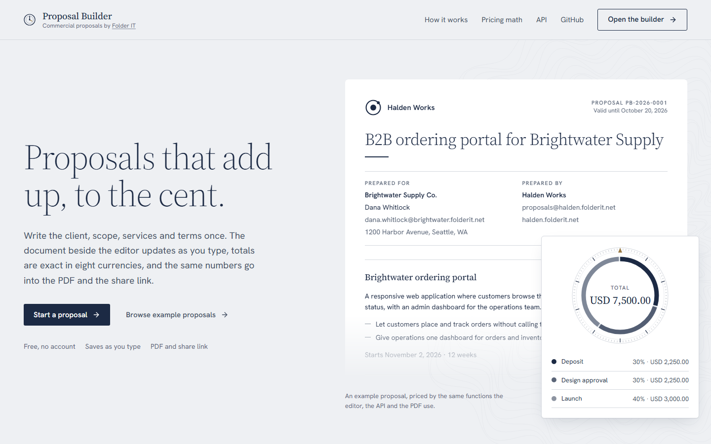
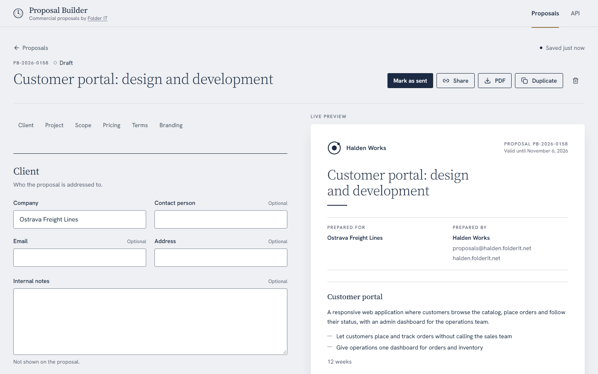
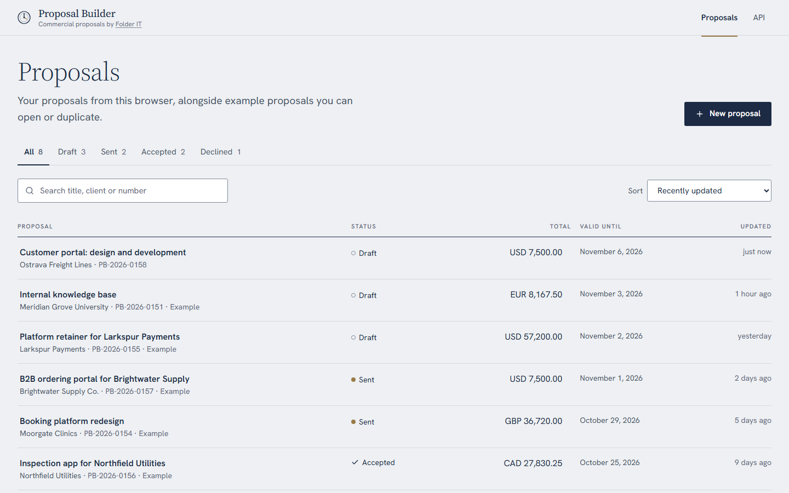
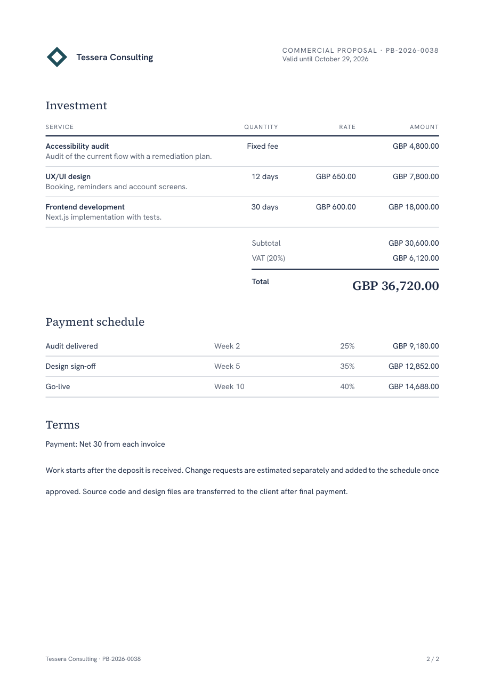

<div align="center">
  <p>
    <a align="center" href="https://www.folderit.net" target="_blank">
      
    </a>
  </p>

<br>

[web proposal builder](https://github.com/FolderITDev/web-proposal-builder)

<br>

[](LICENSE.md)


[](.github/workflows/quality.yml)

</div>

<details>
<summary><strong>Table of Contents</strong></summary>

- [Hello](#hello)
- [Overview](#overview)
  - [What this is](#what-this-is)
  - [What this is not](#what-this-is-not)
  - [Features](#features)
- [Screenshots](#screenshots)
- [Install](#install)
- [Quickstart](#quickstart)
- [Architecture](#architecture)
  - [Repository layout](#repository-layout)
  - [API](#api)
  - [Database](#database)
  - [Engineering decisions](#engineering-decisions)
- [Tests and verification](#tests-and-verification)
- [SEO and structured data](#seo-and-structured-data)
- [Privacy and limitations](#privacy-and-limitations)
- [Documentation](#documentation)
- [FAQ](#faq)
- [About Folder IT](#about-folder-it)
- [License](#license)

</details>

## Hello

**[Folder IT](https://folderit.net) is a nearshore software development company that builds and scales AI-ready engineering teams for U.S. companies.** With 220+ software engineers, Folder IT delivers senior technical talent for organizations building AI software.

**Core capabilities:** Nearshore Staff Augmentation · AI-Ready Engineering Teams · AI Software Development · IoT Development · Web & Mobile Apps · Salesforce Consulting · ServiceNow Development

This repository holds one of its products: **Proposal Builder**, a full-stack web application for writing commercial proposals, built with Next.js 16, React 19, strict TypeScript, PostgreSQL and Drizzle ORM. A freelancer, agency or software company fills in the client, project, scope, services, pricing, terms and branding; the document beside the editor updates as they type, every change is saved automatically, and the result exports to PDF or opens from a share link.

## Overview

### What this is

- A **full-stack web application**: a public, indexable landing page, a multi-section editor with live preview, a REST API documented with OpenAPI 3.1 and PostgreSQL with migrations.
- **Complex business forms done carefully**: nested lists, derived money, validation as you type, autosave with optimistic concurrency, a status lifecycle and read-only states.
- **Exact money handling**: integer cents end to end, one pricing function shared by the browser, the API and the PDF, and payment schedules that add up to the total without losing a cent.
- Original source code under the MIT license, with self-hosted fonts.

### What this is not

- Not an e-signature, invoicing or CRM product. Proposals can be marked accepted, but nothing is signed, invoiced or emailed.
- Not a multi-user workspace. There are no accounts, roles or comments; proposals belong to the browser that created them.
- Not a document designer. Layout is fixed and professional; authors control content, a logo mark, a brand color and contact details.

### Features

- **Templates.** Start from a web application, mobile application, monthly retainer or blank proposal, or duplicate any example.
- **Editor with live preview.** Client, project (summary, objectives, start date, duration), scope (included or excluded, with notes), services (hours, days, weeks, units or fixed fees), pricing (eight currencies, percentage or fixed discount, labeled tax), terms (payment terms, validity, milestones, conditions, notes) and branding (four generated logo marks, six brand colors or any hex, contact details).
- **Autosave that never overwrites.** Valid changes save about a second after typing stops. Each save carries the version it started from; a save from a stale tab is rejected with 409 and the editor asks to reload instead of overwriting.
- **Status lifecycle.** Draft → sent → accepted or declined. Only drafts are editable; a sent proposal can return to draft, an accepted one is final.
- **Exact totals.** Line totals, subtotal, discount, tax and total in integer cents, plus milestone amounts split by largest remainder.
- **PDF export and share links.** A server-rendered A4 PDF from the saved proposal, and a read-only page behind an unguessable token.
- **Dashboard.** Status tabs with counts, search by title, client or number, sorting by update time, total or number, pagination in the URL, and expiry flags for sent proposals.

## Screenshots

<p align="center">
  
  
</p>
<p align="center">
  
  
</p>

<sub>Captured from a production build of this repository in Chromium at 1440 × 900; the PDF page is rendered by the API.</sub>

## Install

Requirements:

- **Node.js 24 or later** (pinned in `.node-version`) and **pnpm 10** (pinned in `packageManager`; `corepack enable` installs it).
- **Docker** to run PostgreSQL 17 locally, or any PostgreSQL 15+ server.
- No API keys, accounts or paid services.

```bash
git clone https://github.com/FolderITDev/web-proposal-builder.git
cd web-proposal-builder
pnpm install
cp .env.example .env
```

This folder is standalone: it has its own dependencies, lockfile and database, and imports nothing from other Folder IT repositories.

## Quickstart

```bash
docker compose up -d
```

```bash
pnpm db:migrate
```

```bash
pnpm db:seed
```

```bash
pnpm dev
```

Open [http://localhost:3020/apps/proposal-builder](http://localhost:3020/apps/proposal-builder). The app is served under the `/apps/proposal-builder` base path.

**Quick tour**

1. Choose **Start a proposal**. A web-application template opens in the editor.
2. Change the client company and a rate. The preview, the line amount, the subtotal dial and the payment schedule update as you type; the toolbar reads **Saved** a moment later.
3. Set a 10% discount and 21% VAT under **Pricing**, then check the milestone amounts under **Terms**.
4. Choose **PDF** to download the document, or **Share** to copy its read-only link.
5. Choose **Mark as sent**. The editor becomes read-only until you move it back to draft.
6. Open an accepted example from the dashboard and choose **Duplicate to edit**.

## Architecture

```text
Browser ──── React Hook Form + Zod · live preview · autosave with version ────┐
   │                                                                          │
   ▼                                                                          ▼
Next.js App Router ── Server Components for public pages and the share page · client editor
   │
   ▼
REST API (Route Handlers) ── Zod in and out · RFC 9457 problems · 409 on stale versions
   │
   ▼
Services ── templates, lifecycle, ownership ──► Domain (money, totals, status, templates)
   │                                   │
   ▼                                   ▼
Repositories ── Drizzle, transactions   PDF renderer ── React PDF, same model and totals
   │
   ▼
PostgreSQL ── proposals + scope items + line items + milestones
```

The editor keeps the document in React Hook Form. Every change re-renders the preview with totals from `documentTotals`, the same function the API uses before saving. When the document is valid and differs from the last saved version, it is sent with `PATCH` and its `version`; the server updates the proposal only if the version still matches, replaces the child rows in the same transaction and returns the new version.

### Repository layout

| Path                      | What it holds                                                                                                              |
| ------------------------- | -------------------------------------------------------------------------------------------------------------------------- |
| `src/app/(marketing)/`    | Public, indexable pages: the landing page and the API reference.                                                           |
| `src/app/(tool)/`         | The dashboard, template picker and editor. Marked `noindex`.                                                               |
| `src/app/p/[token]/`      | The read-only share page. Marked `noindex, nofollow`.                                                                      |
| `src/app/api/`            | Route Handlers: thin adapters from HTTP to services.                                                                       |
| `src/domain/proposal/`    | Money, totals, milestone splitting, status lifecycle and templates. No I/O.                                                |
| `src/server/`             | Server-only: services, repositories, the Drizzle schema and seed, the PDF renderer, HTTP helpers and the OpenAPI document. |
| `src/lib/validation/`     | Zod contracts shared by the API, the editor and the OpenAPI document.                                                      |
| `src/features/proposals/` | The editor (sections, inputs, autosave), dashboard and TanStack Query options.                                             |
| `src/components/`         | The design system: the proposal sheet, the sub-dial, the guilloché, buttons, fields and feedback.                          |
| `src/content/`            | Example proposals and FAQ copy.                                                                                            |
| `drizzle/`                | Generated SQL migrations.                                                                                                  |
| `tests/`, `e2e/`          | Vitest (unit, components, integration) and Playwright with axe.                                                            |
| `docs/`                   | Architecture, API errors, AI-assisted engineering, font licenses and screenshots.                                          |

### API

| Method   | Path                            | Purpose                                                                                              |
| -------- | ------------------------------- | ---------------------------------------------------------------------------------------------------- |
| `GET`    | `/api/proposals`                | List examples and your proposals, with counts per status. `page`, `pageSize`, `status`, `q`, `sort`. |
| `POST`   | `/api/proposals`                | Create a draft from a template.                                                                      |
| `GET`    | `/api/proposals/{id}`           | One proposal with its document and computed totals.                                                  |
| `PATCH`  | `/api/proposals/{id}`           | Save the document and/or change the status, with the `version` you read.                             |
| `DELETE` | `/api/proposals/{id}`           | Delete one of your proposals.                                                                        |
| `POST`   | `/api/proposals/{id}/duplicate` | Copy a visible proposal into a new draft.                                                            |
| `GET`    | `/api/proposals/{id}/pdf`       | The proposal as a PDF.                                                                               |
| `GET`    | `/api/share/{token}/pdf`        | The PDF behind a share link.                                                                         |
| `GET`    | `/api/openapi.json`             | OpenAPI 3.1 document.                                                                                |
| `GET`    | `/api/health`                   | Liveness and database readiness.                                                                     |

All paths are relative to `/apps/proposal-builder`. Amounts are integer minor units (`…Minor`), rates and shares are basis points (`…Bps`). Errors use `application/problem+json` with a stable `code`; see [docs/api.md](docs/api.md).

```bash
curl -i -X POST http://localhost:3020/apps/proposal-builder/api/proposals -H "Content-Type: application/json" -d '{"template":"retainer"}'
```

### Database

Defined in [`src/server/db/schema.ts`](src/server/db/schema.ts):

- `proposals`: the single-valued sections as columns (client, project, pricing, terms, branding), status, version, share token, a derived `total_minor` for sorting, and timestamps. The human-readable number comes from a sequence (`PB-2026-0042`).
- `proposal_scope_items`, `proposal_line_items`, `proposal_milestones`: ordered child rows with `position`, cascading on delete. Quantities are stored in hundredths and prices in minor units.
- Check constraints keep tax rates, milestone shares, quantities, prices and brand colors valid, and require each proposal to be an example or owned by a session. Unique indexes cover the number, the share token and each child position.

```bash
pnpm db:generate   # create a migration after changing the schema
pnpm db:migrate    # apply migrations
pnpm db:seed       # replace the example proposals; visitor proposals are untouched
```

### Engineering decisions

- **One pricing function.** `computeTotals` and `documentTotals` in `src/domain/proposal` are used by the preview, the API, the share page and the PDF. A total can never be computed two ways.
- **Integer money.** Amounts are cents; quantities are hundredths. Each step rounds once, in a fixed order, and milestone amounts use the largest-remainder method so they always add up to the total.
- **Optimistic concurrency.** A `version` column and a conditional `UPDATE` turn a lost update into an explicit 409. The editor stops autosaving and offers a reload; nothing is silently overwritten.
- **Normalized lists, whole-document saves.** Child tables keep the data relational and constrained; a save replaces the document's lists inside one transaction, which keeps the API simple for autosave.
- **Rules on the server.** Status transitions, editability and ownership are enforced by the service, not by the buttons that call it.
- **Server-rendered documents.** The PDF is rendered with React PDF from the saved proposal, so it does not depend on a browser print dialog, and uses the same fonts as the interface.
- **Restrained motion.** The sub-dial's segments retime with a CSS transition when totals change; switches and segmented controls ease in under 200 ms; reduced motion is respected.

Full rationale: [docs/architecture.md](docs/architecture.md).

## Tests and verification

```bash
pnpm check          # ESLint, typegen + strict TypeScript, and every Vitest project
pnpm format:check   # Prettier, including Tailwind class order
pnpm build          # production build
pnpm test:e2e       # Playwright against the production build (desktop and mobile)
```

The suites cover:

- **Unit:** money parsing and formatting, line rounding, discount capping, tax, the brief's 40 h / 180 h / 30 h example, milestone splitting without lost cents, status transitions, expiry, numbering, templates and document validation.
- **Components:** the proposal sheet and its excluded scope, the sub-dial's text alternative, money and percentage inputs, the segmented radio group and status badges.
- **Integration:** every endpoint through its real Route Handler and PostgreSQL: creation from templates, saving with recomputed totals, 409 on stale versions, the status lifecycle, validation paths, read-only examples, privacy between visitors, filters, search, sorting, pagination, duplication, deletion, PDF rendering by ID and by share token, and the OpenAPI document.
- **End-to-end:** creating, editing and autosaving a proposal and downloading its PDF; duplicating a read-only example; sending a proposal and opening its share link; indexing rules and structured data; and axe WCAG 2.2 AA checks on five pages, at desktop and mobile sizes.

The same checks run in GitHub Actions on every push and pull request ([`.github/workflows/quality.yml`](.github/workflows/quality.yml)), with PostgreSQL as a service container.

## SEO and structured data

- The landing page and the API reference are prerendered, with a unique `<h1>`, title, description, canonical URL, Open Graph and Twitter metadata, and a generated social image.
- JSON-LD: `Organization` (Folder IT), `WebApplication` / `SoftwareApplication` with `creator` and `publisher`, `BreadcrumbList` and `FAQPage`.
- `sitemap.xml` lists only indexable pages; the tool is `noindex, follow`; share pages are `noindex, nofollow` with `no-referrer`; `/llms.txt` summarizes the application for AI assistants.
- Set `SITE_ORIGIN` to the public origin for production builds, and reference `/apps/proposal-builder/sitemap.xml` on that origin from the root `robots.txt`.

## Privacy and limitations

- Proposals are tied to an anonymous HttpOnly cookie, stored as the SHA-256 hash of its token. Anyone with a share link can read that proposal. Proposals untouched for seven days are deleted; example proposals are permanent.
- One currency per proposal, with two minor digits. There are no exchange rates.
- Logos are generated marks; uploading an image is not supported.
- The PDF layout is fixed and uses Latin fonts; scripts outside Latin are not covered.
- The rate limiter runs in process; a multi-instance deployment would move it to a shared store.

## Documentation

- [Architecture and decisions](docs/architecture.md)
- [API errors and conventions](docs/api.md)
- [Design system](DESIGN.md): Guilloché Dial, with Source Serif 4, Hanken Grotesk, opaline, midnight and one brass index.
- [AGENTS.md](AGENTS.md): rules and workflow for contributors and AI coding agents.
- [AI-assisted engineering](docs/ai-engineering.md)
- [Contributing](CONTRIBUTING.md) · [Security](SECURITY.md) · [Third-party notices](THIRD_PARTY_NOTICES.md)

## FAQ

<details>
<summary>What is Folder IT?</summary>

Folder IT is a nearshore software development and AI staff augmentation company. It builds and staffs AI Pods — small, senior engineering teams led by a Forward Deployed Engineer — for US-based companies.

</details>

<details>
<summary>What services does Folder IT provide?</summary>

Folder IT provides nearshore software engineering services for US companies:

- Artificial Intelligence Project Development (GenAI, LLMs, RAG systems, AI Agents, NLP, Computer Vision, MLOps)
- AI Pods and AI Solutions Builder
- IT Staff Augmentation & Outsourcing
- ServiceNow Implementation & Integration
- Salesforce Services
- Web Apps Development
- Mobile Apps Development
- Internet of Things Project Development
- Data Migration & Integration

</details>

<details>
<summary>What is a Folder IT AI Pod?</summary>

An AI Pod is a delivery model where one senior engineer (the Forward Deployed Engineer) owns a problem end to end, working with AI coding agents as a core part of the execution stack, backed by an internal AI Lab for architecture and technical review. It is not a project manager coordinating a team of developers.

</details>

<details>
<summary>Is this repository production-ready?</summary>

No. Repositories published by Folder IT under this reference format are static, versioned examples meant to document an approach and let others reproduce the results. They are not maintained as production dependencies. Proposal Builder in particular has no accounts, signatures or email delivery.

</details>

<details>
<summary>Can I use this code commercially?</summary>

Yes, under the license specified in this repository (see the [LICENSE](LICENSE.md) file). Bundled fonts keep their own licenses, listed in [THIRD_PARTY_NOTICES.md](THIRD_PARTY_NOTICES.md).

</details>

<details>
<summary>Does this repository call any external LLM or API?</summary>

No. The application makes no outbound network requests at runtime: pricing is plain TypeScript, PDFs are rendered on the server, fonts are self-hosted and there is no analytics or third-party service.

</details>

<details>
<summary>Why are amounts stored as integers?</summary>

Because binary floating point cannot represent most decimal amounts exactly. Storing cents as integers, rounding once per step and splitting milestones by largest remainder means the preview, the API, the database and the PDF always agree to the cent.

</details>

<details>
<summary>How can I contact Folder IT?</summary>

Through [folderit.net](https://folderit.net).

**Nearshore IT Staff Augmentation | Top LATAM Developers | Folder IT** — scale your engineering team and hire developers from Argentina. Same timezone, lower cost, 25+ years with US companies. [Talk to our team](https://folderit.net).

</details>

## About Folder IT

Folder IT is a software development company focused on building custom web and mobile applications, business platforms and digital products. Proposal Builder is built with the architecture and practices the team uses for client business software: complex validated forms, concurrency-safe autosave, exact money handling, normalized PostgreSQL models, server-side document generation and automated tests at every layer.

## License

Released under the [MIT License](LICENSE.md). Copyright (c) 2026 Folder IT.

<br>

<div align="center">
  <p>
<a href="https://www.linkedin.com/company/folderit"></a>&nbsp;&nbsp;&nbsp;&nbsp;&nbsp;<a href="https://www.instagram.com/folderit.social/"></a>&nbsp;&nbsp;&nbsp;&nbsp;&nbsp;<a href="https://x.com/folderit"></a>&nbsp;&nbsp;&nbsp;&nbsp;&nbsp;<a href="https://www.youtube.com/@folderit"></a>&nbsp;&nbsp;&nbsp;&nbsp;&nbsp;<a href="https://www.tiktok.com/@folder_it"></a>&nbsp;&nbsp;&nbsp;&nbsp;&nbsp;<a href="https://www.facebook.com/folderit.social"></a>
  </p>
</div>
